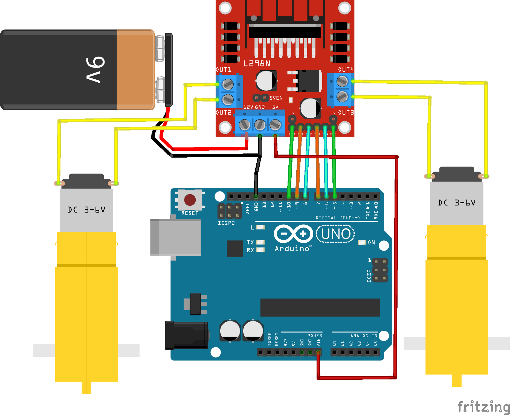

# L298N con Arduino
Práctica de robótica en la que aprenderemos a controlar motores DC con el módulo L298N y Arduino

## Materiales
* 1 x Arduino Uno
* 2 x Motor DC
* 1 x Módulo L298N
* 1 x Protoboard
* Cables Dupont o puentes para protoboard

## Instrucciones
1) Armar el circuito como se muestra en el Layout.
2) Descargar el codigo .ino y abrirlo en el IDE de Arduino.
3) Revisar que el código este correcto y cargarlo al Arduino.

## Layout
